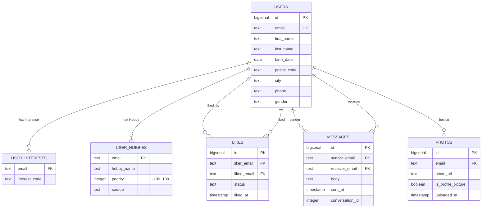

# Zielmodell — LetsMeet (Akt 2, V2)

Physisches Modell des PostgreSQL-Zielsystems. Der Aufbau läuft verbindlich in der
Reihenfolge **leeren → Schema erzeugen → Excel-Import → MongoDB-Import → prüfen**.
Die DDL liegt in `results/modelle/ddl-ziel.sql` und identisch im
Java-`SchemaCreator` (`src/main/java/com/encoway/importer/db/SchemaCreator.java`).

## ER-Diagramm

Das ER-Diagramm entsteht in der Begleit-Website (LetsMeet-Modellierungsstation).
Die **Share-URL** wird hier und in der Befundnotiz gesichert:

- ERD-Share-URL: https://station.heidelab.de/letsmeet-erd/#d=1.lVPLcpwwEPyXORMKJECIWxzn4UribMquHJzag1hmF5VBuCSRsr3Ft-TiP9kfc-HFG0GMHzdpNNMz3dPagmjXG5HjSQEZVGhNjWjBg7opsKog2wIqK61Aiwqy31tQokbIYIHaNAo8ENZqmbcW3deP774LWUHnHSK_Gv1wckKnYlVOY58xb7U1hbBt7cbPscJ1o8apZlVWuCqtG93PdXIMHkhjz1Zl1aIxWEFmdYtO4pnVYvd31Hzx7cK9_tAWuqUTOFEWdY82R_uQ8KEpcGaC5UQBLXsGM4CHhFP9IqFzvB4pcYHSXrXqchT82qg_qI2wslHmVI_5fWpsMzdJ__aKIY6FRTld6kI3a1nlsirG_b40eX4z1_AIb1GuStWqDUxrZgdZdksPcryVWLZqMzhWuHbNJ3scYEvR7-BS6OI9ZFAP5yPIYO-5_zDc1Q0YBlWBLkz4Mswg-ZNTvKL8UcFR_ZNy_myxqiZbkY2WdnfXu_xN3A-XAakWm7m2Z1bY1szYcvmvU-3wfh1X0z7zbxZ6d7dGjer2rdye2CvWV-vdndq8cTdTlXJca2wnFlHgatD_DrhqjOy_Z-_e7SNKtoVryELCic9jmsYsDEjKeOzBDWQsSP2EhSQgjKaER2nnOR4fShn3wySNIxLxiBOa0ofSKAr8IIgoDRllURqEtPMcDfa1JAoSn1EespCFQUrjdF-bMD_mEeWMBiROkjjpvL2hn20ZEp74MSE0iniaxCzsy_bLfZZlSBj3Y5oGjPazBJx1XXcP
  (gespeichert 2026-08-27 — Begleit-Website meldet „Freigabe-URL gespeichert“)

## Datenherkunft

| Tabelle            | Quelle             | Importweg                     |
|--------------------|--------------------|-------------------------------|
| `users`            | Excel + MongoDB    | Java (Excel) / Python (Mongo) |
| `user_interests`   | Excel              | Java                          |
| `user_hobbies`     | Excel              | Java (`source = 'excel'`)     |
| `likes`            | MongoDB            | Python                        |
| `messages`         | MongoDB            | Python                        |
| `photos`           | MongoDB (Akt 3)    | —                             |

## Modellentscheidungen

- **3. Normalform:** Jede Zuordnung (Interesse, Hobby, Like, Nachricht, Foto) ist eine eigene
  Tabelle. Keine Liste in einer Zelle, kein Mehrfachwert.
- **E-Mail als Verbindung der Quellen:** eindeutig, case-insensitiv; in den Views erscheint die
  Schreibweise der Excel-Quelle (Vertrag V2).
- **Priorität −100…100:** der fachlich mit der Kundin vereinbarte Bereich; die aktuelle
  Datenlieferung schöpft ihn nicht aus (vorgefunden: 0–100).
- **Keine Codetabellen:** `gender`/`interest_code` übernehmen die Quellwerte unverändert.
- **`source` an der Hobbyzuordnung:** dokumentiert die Herkunft; in Akt 2 durchgängig `excel`.
- **`photos`** gehört zu Akt 3, wird aber schon jetzt modelliert, damit das Schema stabil bleibt.