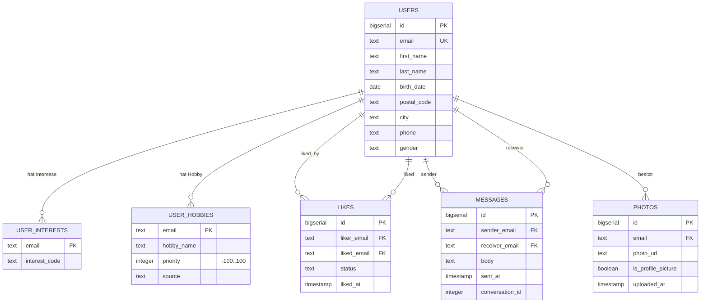

# Zielmodell — LetsMeet (Akt 2, V2)

Physisches Modell des PostgreSQL-Zielsystems. Der Aufbau läuft verbindlich in der
Reihenfolge **leeren → Schema erzeugen → Excel-Import → MongoDB-Import → prüfen**.
Die DDL liegt in `results/modelle/ddl-ziel.sql` und identisch im
Java-`SchemaCreator` (`src/main/java/com/encoway/importer/db/SchemaCreator.java`).

## ER-Diagramm

Das ER-Diagramm entsteht in der Begleit-Website (LetsMeet-Modellierungsstation).
Die **Share-URL** wird hier und in der Befundnotiz gesichert:

- ERD-Share-URL: *(hier eintragen)*

## Datenherkunft

| Tabelle            | Quelle             | Importweg                     |
|--------------------|--------------------|-------------------------------|
| `users`            | Excel + MongoDB    | Java (Excel) / Python (Mongo) |
| `user_interests`   | Excel              | Java                          |
| `user_hobbies`     | Excel              | Java (`source = 'excel'`)     |
| `likes`            | MongoDB            | Python                        |
| `messages`         | MongoDB            | Python                        |
| `photos`           | MongoDB (Akt 3)    | —                             |

## Modellentscheidungen

- **3. Normalform:** Jede Zuordnung (Interesse, Hobby, Like, Nachricht, Foto) ist eine eigene
  Tabelle. Keine Liste in einer Zelle, kein Mehrfachwert.
- **E-Mail als Verbindung der Quellen:** eindeutig, case-insensitiv; in den Views erscheint die
  Schreibweise der Excel-Quelle (Vertrag V2).
- **Priorität −100…100:** der fachlich mit der Kundin vereinbarte Bereich; die aktuelle
  Datenlieferung schöpft ihn nicht aus (vorgefunden: 0–100).
- **Keine Codetabellen:** `gender`/`interest_code` übernehmen die Quellwerte unverändert.
- **`source` an der Hobbyzuordnung:** dokumentiert die Herkunft; in Akt 2 durchgängig `excel`.
- **`photos`** gehört zu Akt 3, wird aber schon jetzt modelliert, damit das Schema stabil bleibt.